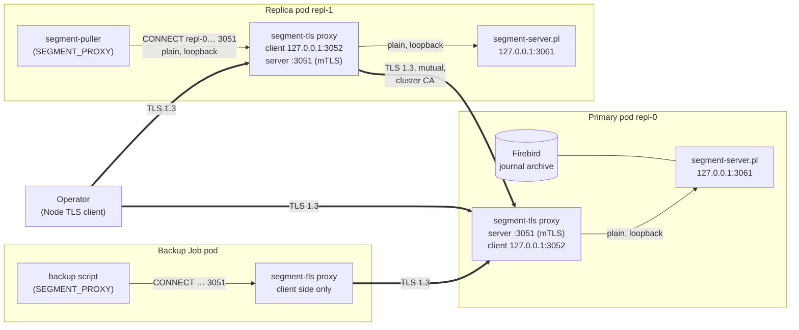
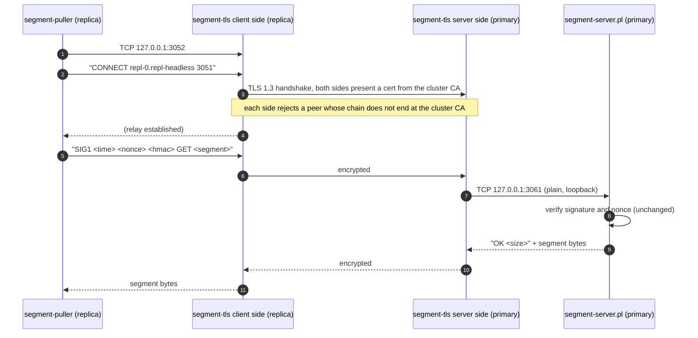
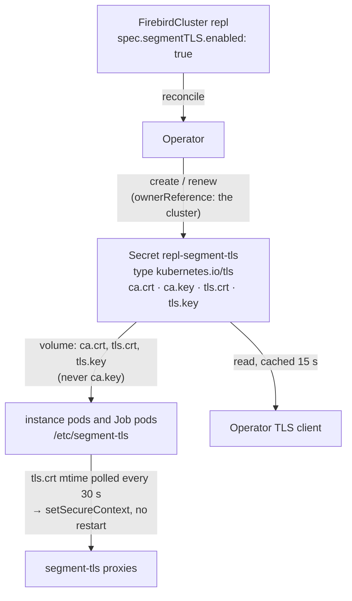
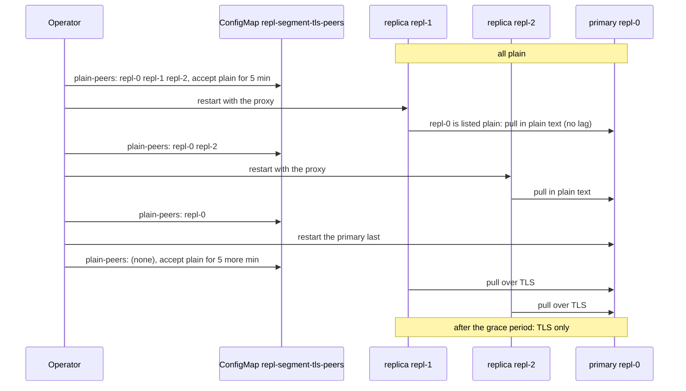

# Segment TLS: encrypted segment shipping between instances

`spec.segmentTLS.enabled` encrypts and mutually authenticates every connection to a cluster's
**segment servers**: journal segments shipped from the primary to the replicas, the seed copies
that build a new replica, backup files fetched by backup and restore Jobs, and the operator's own
lag, health and isolation checks. This page explains why it exists, how it works, how to turn it on
and off safely, and what it does and does not protect.

- [Why it is needed](#why-it-is-needed)
- [Doesn't Firebird's SRP already encrypt this?](#doesnt-firebirds-srp-already-encrypt-this)
- [Why a proxy sidecar](#why-a-proxy-sidecar)
- [Architecture](#architecture)
- [Certificates](#certificates)
- [Enabling and disabling](#enabling-and-disabling)
- [Verifying it](#verifying-it)
- [Security properties and limits](#security-properties-and-limits)
- [Troubleshooting](#troubleshooting)
- [Reference](#reference)

## Why it is needed

Firebird clients (applications, `isql`, `gbak` over the network) are already encrypted by
Firebird's own wire protocol (WireCrypt, see *Encryption in Transit* in the README). Replication
in this operator does not use that protocol. Each instance runs a small **segment server** (Perl,
port 3051) next to Firebird, and the instances and Jobs exchange files with it:

| Traffic | From → to | Carries |
|---|---|---|
| Journal segments | replica's segment puller → primary | every committed change: row data, including whatever personal or secret data the tables hold |
| Seed copies | new replica's `replication-init` → primary or a ready replica | a complete copy of the database file |
| Backup files | backup / restore Jobs → instance (`backup-files` without replication) | full logical and physical backups |
| Control requests | operator, failover and switchover Jobs → every instance | lag, retention floor, isolation contact, `SYNC`, `REJOIN`, headers |

Until v0.75.0 all of this was plain TCP inside the cluster. The protections already in place
covered *who may ask*, not *who may read*:

- **Signed requests (v0.64.0).** Requests carry an HMAC-SHA256 over the request, its time and a
  nonce instead of the SYSDBA password. The password never crosses the network and a captured
  request cannot be replayed or altered. The **replies are not signed or encrypted**, so a reader
  on the path sees the whole database stream.
- **NetworkPolicy (`networkPolicy.enabled`).** It restricts which pods may *connect* to port 3051.
  It does nothing against anyone who can *observe* the traffic.

Pod-to-pod traffic can be observed more often than people assume:

- Most CNI plugins send pod traffic between nodes unencrypted, across the data-centre or cloud
  network, a shared VLAN or a VPN between sites (stretched clusters, multi-zone node pools).
- Anyone with `hostNetwork` access or root on a node, a compromised node, or a packet-capture
  DaemonSet sees the traffic of every pod on that node.
- Compliance regimes (PCI DSS, HIPAA, ISO 27001, many internal policies) require encryption in
  transit for this kind of data, including inside the cluster. "The database is encrypted for
  clients but the replica stream is plain text" is a finding in an audit.
- CloudNativePG, the operator this project follows, uses TLS between instances for streaming
  replication by default. Replication in Firebird clusters should give the same guarantee.

Segment TLS closes that gap. Everything that leaves an instance pod on the segment port is
encrypted with TLS 1.3. Both ends must prove that they hold a certificate from the cluster's own
CA.

## Doesn't Firebird's SRP already encrypt this?

No. SRP and WireCrypt protect only connections that use **Firebird's own network protocol**, and
journal segment shipping does not use it.

- **SRP** (Secure Remote Password, `AuthServer = Srp256`) lets a client prove that it knows the
  password without sending it, and gives both sides a shared session key.
- **WireCrypt** encrypts the connection with that key (ChaCha64, ChaCha or Arc4). Firebird 4 and
  later require it on the server by default (`WireCrypt = Required`).

Together they protect:

- applications, `isql` and network `gbak` connecting to port 3050;
- Firebird's own **synchronous** replication: with `sync_replica` the primary attaches to the
  standby's database over the Firebird protocol, so that connection already gets SRP and WireCrypt.

They do **not** protect the segment server. Firebird's **asynchronous** replication only writes
journal segments to files in the primary's journal archive; Firebird itself does not move them to
another machine. This operator ships them with its own segment server on port 3051, a separate plain
TCP service that Firebird knows nothing about. It carries the journal segments (every committed row
change), complete database copies when a replica is seeded, and backup files. None of that passes
through a Firebird connection, so SRP and WireCrypt never apply to it. Before segment TLS this
traffic was readable by anyone who could observe pod traffic, even with `WireCrypt = Required` and
Srp256 on every instance.

| Connection | Protocol | Authentication | Encryption |
|---|---|---|---|
| Client → Firebird (3050) | Firebird | SRP | WireCrypt (`tls.enabled` makes it strict) |
| Primary → synchronous standby (`sync_replica`) | Firebird | SRP | WireCrypt |
| Journal segments, seeds, backup files (3051) | segment server | signed requests (HMAC, since v0.64.0) | **none, unless `segmentTLS.enabled`** |
| Operator, Jobs → segment server (3051) | segment server | signed requests | **none, unless `segmentTLS.enabled`** |

Request signing borrows SRP's idea for the segment server: a request carries an HMAC instead of
the SYSDBA password, so the password never crosses the network. But like SRP without WireCrypt, it
only authenticates the request. The data coming back stays readable, and segment TLS is what
encrypts it.

## Why a proxy sidecar

The obvious approach, TLS inside the Perl segment server and its clients, is not possible with the
official `firebirdsql/firebird` images. Alternatives were measured or ruled out:

| Option | Result |
|---|---|
| TLS in Perl (`IO::Socket::SSL`) | not installed; the images ship `perl-base` only, and the operator does not modify them |
| `openssl s_client` / `stunnel` / `socat` | none are in the images (Debian trixie, only `libssl.so.3` is present) |
| A cipher in pure Perl (ChaCha20) | 0.47 MB/s measured: a 1 GB seed would take more than half an hour |
| Carrying the bytes over a Firebird connection (WireCrypt) | considered and rejected, see the note below |
| A service mesh (Istio, Linkerd mTLS) or an encrypting CNI (WireGuard) | works, and can be combined with this feature, but is outside the operator's control and not present in most clusters |
| **A proxy from the operator image** | Node.js with OpenSSL is already there, the image is already pulled by the cluster, and it runs as an unprivileged, read-only container |

> **Note: why not ship the segments over a Firebird connection instead?**
> It was considered, since it would reuse the SRP authentication and WireCrypt encryption that
> Firebird already has. It was rejected because it would need a Firebird client in every Job and a
> database attachment just to move files. Firebird has no API for transferring arbitrary files, so
> the bytes would have to be packed into BLOBs and unpacked on the other side through SQL. Seeding
> and physical backups copy raw database and journal files, which an attachment cannot read as
> files. And replication would depend on the database accepting connections: it would stop during
> a full shutdown or fencing, exactly when the segment server is needed. The TLS proxy is simpler,
> moves the bytes unchanged at full speed, and does not depend on Firebird's protocol.

The proxy (`operator/src/segment-tls.ts`, `dist/segment-tls.js` in the operator image) is about 150
lines. It does not interpret the segment protocol. It relays bytes in both directions, so the Perl
segment server and its clients keep their protocol, request signing and checks unchanged. The
clients' only change is that they connect through it.

## Architecture

### Pods

With segment TLS on, every instance pod gets a `segment-tls` container. It runs as a **native
sidecar**: an init container with `restartPolicy: Always`, so it starts before the replication init
container (seeding needs it) and keeps running beside Firebird. Each proxy has two sides:

- **Server side** (`SERVER_LISTEN=0.0.0.0:3051`): accepts mutual TLS on the segment port and
  forwards each connection to the segment server. The segment server now listens on
  `127.0.0.1:3061` only (`SEGMENT_LISTEN`), so it cannot be reached from outside the pod at all.
- **Client side** (`CLIENT_LISTEN=127.0.0.1:3052`): the pod's Perl clients (`SEGMENT_PROXY`)
  connect here in plain text over the loopback, send one line `CONNECT <host> <port>`, then their
  request as before. The proxy opens mutual TLS to that host and relays.



Only the thick edges cross the pod network, and all of them are TLS. The thin edges stay on the
pod's loopback interface.

### One request, end to end

A replica pulling the next journal segment from the primary:



The signed request (step 5) is the same as without TLS. TLS adds confidentiality, integrity of the
replies, and authentication of the *peer*. The signature still authenticates the *request*.

### The operator

The operator does not run a proxy. It opens TLS itself (`operator/src/utils/replication-lag.ts`)
with the cluster's certificate, which it reads from the Secret. It decides **per pod**: an instance
is reached over TLS when its pod runs the `segment-tls` container, and in plain text otherwise. This
keeps lag measurement, cut-off detection and the isolation check correct while a rolling update
moves the instances from one mode to the other (see below).

## Certificates



- **One CA per cluster**, ECDSA P-256, valid for 10 years. A certificate from another cluster's CA
  is refused, so clusters in the same namespace cannot read each other's segments.
- **One certificate** signed by it, ECDSA P-256, valid for one year, with both `serverAuth` and
  `clientAuth`. All instances and Jobs of the cluster present it. Its names are
  `*.<cluster>-headless`, `*.<cluster>-headless.<namespace>.svc` and `…svc.cluster.local`. These
  names are informational only, see *host names* below.
- **Renewal**: on every reconcile the operator checks the Secret. It replaces the certificate when
  it has 30 days or less left or its names no longer match, and the CA when it has a year or less
  left. A renewed certificate is signed by the same CA, so pods with the old and new certificate
  accept each other while the kubelet propagates the update. The proxies notice the new files
  within 30 seconds and use them for new connections without a restart.
- **The CA's private key** stays in the Secret, which only the operator reads. Pods mount the three
  other keys through `items`. A compromised instance pod can therefore not mint certificates.
- **The Secret is owned by the cluster** and is deleted with it. Turning segment TLS off keeps the
  Secret, so turning it back on reuses the same CA.
- **Host names are not checked.** The Perl clients address instances by short names
  (`repl-0.repl-headless`), and Node rejects wildcard certificates for two-label names. A peer is
  authenticated by its chain to the cluster's CA instead, which only this cluster's pods and the
  operator hold. In this setting that is a stronger check than a name.

To bring your own CA, there is no setting yet. Pre-creating the Secret (type `kubernetes.io/tls`) with
your own `ca.crt` and `ca.key` works: the operator keeps a CA that is valid for more than a year and
only issues the certificate from it.

## Enabling and disabling

Requirements:

- **Kubernetes 1.29 or later.** Native sidecar containers (beta and on by default since 1.29) are
  needed so the proxy runs before and beside the init containers.
- The operator's ClusterRole needs `create` and `update` on Secrets. They are in
  `config/deploy/rbac.yaml` since v0.75.0. Apply it again when upgrading.
- Instance and Job pods must be able to pull the **operator image**. The sidecar uses the image of
  the running operator pod, or `OPERATOR_IMAGE` when set. The cluster spec has no
  `imagePullSecrets` yet, so with a private registry the namespace's default ServiceAccount (or
  the cluster's `serviceAccountName`) must carry the pull secret.

```yaml
apiVersion: firebird.cloudnative-firebird.io/v1
kind: FirebirdCluster
metadata:
  name: repl
spec:
  instances: 3
  replication:
    enabled: true
  segmentTLS:
    enabled: true
```

For a **new cluster** nothing else is needed: the Secret exists before the first pod starts.

For an **existing cluster**, the change is a pod template change, and the normal rolling update
applies: replicas one at a time, the primary last. Between the first replica restart and the primary
restart, the cluster runs in **mixed mode**: some instances run the proxy, the others do not yet.
Since v0.76.0 replication goes on through it (before, the restarted replicas could not pull from the
plain primary and lagged until it restarted).

The operator publishes the instances' modes in a ConfigMap, `<cluster>-segment-tls-peers`, mounted
by every proxy:

| Key | Meaning |
|---|---|
| `plain-peers` | instance pods that serve in plain text: the client side of a proxy connects to them without TLS |
| `accept-plain-until` | epoch milliseconds: until then, the server side of a proxy also accepts plain connections, from instances and Jobs that do not run the proxy |

The server side tells the two apart by the first byte of a connection: a TLS handshake record
starts with `0x16`, and a segment request starts with a letter. Plain connections still need a
signed request, as before segment TLS.



How the operator fills it (on every reconcile, before the StatefulSet, so a restarted instance reads
the current state when it starts):

- **Switching on:** `plain-peers` lists the instance pods that do not run the proxy yet. While any
  is listed, `accept-plain-until` is moved to 5 minutes ahead.
- **Switching off:** `plain-peers` lists every instance. The proxies still running then talk to all
  instances in plain text, as the restarted ones do, and accept plain connections. The ConfigMap is
  deleted once no instance runs the proxy any more.
- **After the switch** (on, every instance running the proxy): the list is empty and
  `accept-plain-until` is no longer moved. Once it has passed, the proxies accept TLS only, and the
  steady state is the same as without the ConfigMap.

The 5-minute grace period covers the kubelet's delay in updating a mounted ConfigMap (up to about
two minutes). A proxy may still see the primary as plain for that long after it restarted with TLS,
and its plain connections are accepted meanwhile.

What to expect during the switch:

- **Replication goes on.** Each connection uses the mode of the instance it reaches, plain or TLS.
  Expect at most a few seconds of extra lag around each restart, as with any rolling update.
- **The operator keeps measuring** every instance in the mode its pod runs, so lag, cut-off
  detection and the isolation check stay accurate.
- **Jobs** (backups, restores, failover helpers) work during the switch as well: Jobs with the proxy
  read the same ConfigMap, and Jobs without it are accepted by the proxies until the grace period
  ends.
- **The traffic is plain until the switch is over.** Connections to or from an instance that does
  not run the proxy are not encrypted, which is what the cluster had before. Once every instance
  runs the proxy and the grace period has passed, plain connections are refused.
- **Synchronous replication** behaves as in any rolling update (`synchronous.detachForUpdates`).

Never edit the ConfigMap by hand: the operator rewrites it, and listing an instance that serves TLS
as plain makes the proxies connect to it in plain text, which it refuses once the grace period is
over.

## Verifying it

```sh
# the Secret, created by the operator
kubectl get secret repl-segment-tls -o jsonpath='{.type}{"\n"}'          # kubernetes.io/tls

# every instance runs the proxy
kubectl get pods -l firebird.cloudnative-firebird.io/cluster=repl \
  -o jsonpath='{range .items[*]}{.metadata.name} {.spec.initContainers[0].name}{"\n"}{end}'

kubectl logs repl-0 -c segment-tls      # accepting on 0.0.0.0:3051, forwarding to 127.0.0.1:3061
kubectl logs repl-0 -c segment-server   # listening on 127.0.0.1:3061 (segment TLS on 3051)

# a signed request through the proxy is answered ...
kubectl exec repl-1 -c segment-server -- perl /etc/firebird-operator/segment-request.pl repl-0.repl-headless PING
# ... the same request in plain text is not
kubectl exec repl-1 -c segment-server -- env -u SEGMENT_PROXY \
  perl /etc/firebird-operator/segment-request.pl repl-0.repl-headless PING

# replicas keep up (0 = caught up)
kubectl get firebirdcluster repl -o jsonpath='{.status.replicationStatus.replicas}'
```

The kind CI runs these checks, plus a backup Job through the proxy, on every pull request.

## Security properties and limits

What segment TLS guarantees:

- **Confidentiality and integrity** of everything on the segment port, both directions: TLS 1.3
  only, with OpenSSL's TLS 1.3 cipher suites (AES-GCM, ChaCha20-Poly1305) and forward secrecy.
- **Mutual authentication**: a connection is accepted only when both ends present a certificate
  from the cluster's CA. Other clusters' pods, other workloads and plain clients are refused at the
  handshake, before the segment server sees a byte. The one exception is the switch itself: while segment TLS is
  being turned on or off, and for 5 minutes after, plain connections with a signed request are
  accepted (see *Enabling and disabling*).
- **The segment server is unreachable from the network**: it listens on the loopback only.
- **Request signing still applies** on top: even a holder of the cluster certificate needs the
  SYSDBA password to make the segment server do anything.

What it does not cover:

- **Loopback traffic inside a pod** (Perl client ↔ proxy, proxy ↔ segment server) is plain. It
  never leaves the pod's network namespace.
- **Files at rest** (journal archive, backups on the volume) are not encrypted by this feature. Use
  encrypted storage classes and Firebird database encryption for that.
- **Client connections** to Firebird are protected by WireCrypt (`tls.enabled`), not by this
  feature.
- **The shared certificate**: all instances of a cluster present the same certificate, so an
  attacker with root in one instance pod can impersonate any instance of *that* cluster. That
  attacker can already read the database files, so the shared certificate adds no access.
- **No certificate revocation.** Rotating the CA means deleting `ca.crt` and `ca.key` from the
  Secret. The operator then issues a new CA and certificate, and pods pick them up within about a
  minute. During that time some connections fail until both ends have the new files.
- **Plain mode is still accepted** by clusters with `segmentTLS` off. There is no global switch that
  forbids plain segment traffic yet (TODO.md, *Segment TLS by default*).

Resource cost: the proxy requests 10m CPU and 32 MiB of memory per pod. TLS 1.3 with AES-GCM runs at
several hundred MB/s per core, so the segment stream, not the cipher, sets the pace.

## Troubleshooting

| Symptom | Cause and fix |
|---|---|
| Pods stay in `Init` with the `segment-tls` container waiting | Kubernetes older than 1.29 (no native sidecars), or the operator image cannot be pulled: check `kubectl describe pod` events; set `OPERATOR_IMAGE` to a pullable image, or add the pull secret to the pods' ServiceAccount |
| Pods stay in `ContainerCreating` with `FailedMount: secret "<cluster>-segment-tls" not found` | the operator could not create it: check the operator log for a 403 and apply `config/deploy/rbac.yaml` (Secrets `create`, `update`) |
| Replica lag grows while switching | check `kubectl get configmap <cluster>-segment-tls-peers -o yaml`: the instances without the proxy must be listed in `plain-peers` and `accept-plain-until` must be in the future; the operator log shows why it could not write it |
| Plain requests are still answered after enabling | expected for 5 minutes after the last instance restarted with the proxy (`accept-plain-until`) |
| Lag stays high after the rolling update | `kubectl logs <replica> -c segment-tls` for handshake errors; check that every pod runs the proxy and mounts the same Secret |
| A backup Job fails during the switch | it reached an instance in the other mode: run it again once the rolling update is done |
| `ERR expected CONNECT <host> <port>` in a client log | a client spoke to the proxy's client side without the `CONNECT` line: a custom script not using `segment_open` (`segment-auth.pl`) |

## Reference

| Item | Value |
|---|---|
| Spec | `spec.segmentTLS.enabled` (boolean, default false) |
| Switch state | ConfigMap `<cluster>-segment-tls-peers` (`plain-peers`, `accept-plain-until`), mounted at `/etc/segment-tls-peers`, written by the operator only while switching |
| Secret | `<cluster>-segment-tls`, type `kubernetes.io/tls`, keys `ca.crt`, `ca.key`, `tls.crt`, `tls.key` |
| Mount | `/etc/segment-tls` (`ca.crt`, `tls.crt`, `tls.key`), read-only |
| Container | `segment-tls`, operator image, `node dist/segment-tls.js`, uid 65532, read-only root, no capabilities |
| Ports | 3051 TLS (pod network), 3052 client side (loopback), 3061 segment server (loopback) |
| Environment | proxy: `SEGMENT_TLS_DIR`, `SERVER_LISTEN`, `SERVER_TARGET`, `CLIENT_LISTEN`; Perl: `SEGMENT_PROXY`, `SEGMENT_LISTEN` |
| Validity | CA 10 years (renewed with 1 year left), certificate 1 year (renewed with 30 days left) |
| Source | `operator/src/segment-tls.ts` (proxy), `operator/src/utils/segment-tls-pods.ts` (pod wiring), `operator/src/utils/segment-tls-client.ts` (Secret, operator client), `operator/src/replication/segment-auth.pl` (`SEGMENT_PROXY`) |
